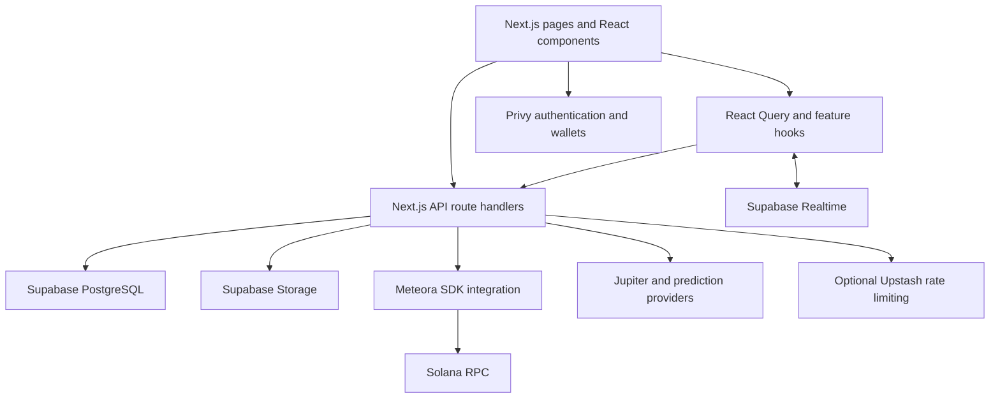

# Flexit

A full-stack social platform prototype exploring how creator content can connect to token-based participation on Solana.

> **Project showcase:** Read the concise developer story in [project_showcase.md](project_showcase.md).

Flexit is designed for creators publishing content and followers discovering creators through a social feed. Posts can be published on their own or with an associated token launch. The repository combines a Next.js application, Supabase persistence and subscriptions, Privy wallet onboarding, and Meteora transaction construction. Prediction markets and swap routing are additional areas of exploration.

**Project status:** a source-reviewable prototype with implemented application flows and incomplete integrations. The strongest review path is post creation, from React state through the API to storage and transaction confirmation. Integration code is not evidence of a verified end-to-end deployment.

[Architecture](#architecture) · [Code map](#code-map) · [Request flow](#primary-request-flow) · [Engineering decisions](#engineering-decisions-and-limitations) · [Setup](#local-setup) · [Walkthrough](#five-minute-code-walkthrough)

## Implementation overview

| Area | Evidence in the repository | Assessment |
| --- | --- | --- |
| Social publishing | [Create page](app/create/page.tsx), [plain-post API](app/api/posts/create-simple/route.ts), [token-post API](app/api/posts/create/route.ts) | Implemented UI and API paths; a useful full-stack review example. |
| Feed and profiles | [Post queries](hooks/usePosts.ts), [Realtime updates](hooks/useRealtimePosts.ts), [creator profile](app/profile/[username]/page.tsx) | Database-backed queries and cache updates are implemented; useful for discussing client state and consistency. |
| Wallet onboarding | [Privy provider](components/providers/PrivyProvider.tsx), [user provisioning](app/api/users/ensure/route.ts) | Client authentication and user-record creation exist; server authorization remains incomplete. |
| Token creation | [Meteora client](lib/meteora-dbc.ts), [DBC configuration](lib/dbc-config.ts) | SDK-based transaction construction, platform signing, submission, and confirmation are implemented. Requires configured accounts, RPC access, and funding to exercise. |
| Prediction markets | [Market API](app/api/predictions/markets/route.ts), [aggregation service](lib/services/unified-predictions-service.ts) | Provider integration with curated mock fallback when results are empty or requests fail. Not proof of live market coverage. |
| Swap execution | [Routing engine](lib/execution/routing-engine.ts), [execution hook](hooks/useBestExecution.ts) | Routing code exists, but this hook explicitly stops at an unimplemented wallet-signing step. |
| Experimental helpers | [Jito bundle engine](lib/execution/jito-bundle-engine.ts), [metadata endpoint](app/api/upload-metadata/route.ts) | Bundle confirmation is simulated in this engine; the separate metadata endpoint returns a mock Arweave URI. These are not completed production capabilities. |

## Architecture



This is a single Next.js application, not a set of independently deployed services. The browser owns presentation, wallet interactions, and cached query state. API handlers coordinate persistence and external integrations. PostgreSQL holds application records; Solana holds on-chain transaction and token state. These systems do not share an atomic transaction.

## Code map

| Responsibility | Start here | What to examine |
| --- | --- | --- |
| Application composition | [app/providers.tsx](app/providers.tsx) | Provider ordering and React Query cache defaults. |
| Publishing experience | [app/create/page.tsx](app/create/page.tsx) | Plain versus token-backed posts, progress state, cache updates, and errors. |
| Feed synchronization | [hooks/usePosts.ts](hooks/usePosts.ts), [hooks/useRealtimePosts.ts](hooks/useRealtimePosts.ts) | Query keys, subscriptions, and profile-specific updates. |
| Backend orchestration | [app/api/posts/create/route.ts](app/api/posts/create/route.ts) | Validation, storage retries, token creation, and sequential database writes. |
| Blockchain integration | [lib/meteora-dbc.ts](lib/meteora-dbc.ts) | Transaction signing, blockhash-based confirmation, and metadata upload. |
| Data model | [db/001_initial_schema.sql](db/001_initial_schema.sql), [db/](db/), [lib/database.types.ts](lib/database.types.ts) | Users, posts, token-related schema extensions, and application types. |
| Data access abstractions | [lib/database/repositories/](lib/database/repositories/), [lib/api/createHandler.ts](lib/api/createHandler.ts) | Repository and handler abstractions alongside routes that still use direct database access. |
| Browser verification | [tests/e2e/](tests/e2e/), [playwright.config.ts](playwright.config.ts) | Feed, authentication, publishing, and Realtime test scenarios. |

## Primary request flow

The token-enabled branch of the create page provides the clearest vertical slice:

1. The page builds multipart form data containing post content, media, ticker, and wallet address, then calls `/api/posts/create`. Plain posts use `/api/posts/create-simple` instead.
2. The token-post handler validates fields and wallet format, checks the posting limit, and finds or creates a user record.
3. Media is uploaded to the `post-media` Supabase bucket with bounded retries. The Meteora client's metadata method also uploads JSON to Supabase Storage; it does not use the separate mock Arweave endpoint.
4. The Meteora client constructs the pool/token transaction, signs with platform and mint keypairs, submits it, and checks confirmation using the signature, blockhash, and last valid block height.
5. The handler writes token and post records, links them, and updates the user's launch count through separate database operations.
6. The UI adds the returned post to the query cache and exposes an explorer link. Realtime subscriptions handle subsequent feed updates.

The [post modal](components/posts/CreatePostModal.tsx) also contains a user-signed branch through [create-signed](app/api/posts/create-signed/route.ts) and [confirm](app/api/posts/confirm/route.ts). These parallel entry points should be reviewed separately; they are not interchangeable contracts.

## Engineering decisions and limitations

### Authentication and authorization

Privy provides the browser authentication experience, but the reviewed user-provisioning and token-post handlers accept a caller-supplied wallet without verifying a Privy token or signed ownership proof. The shared handler's `requireAuth` option checks only for an `x-wallet-address` header. A wallet string is an identifier, not authentication.

Service-role database access simplifies backend operations but bypasses row-level security. Consequently, database policies cannot substitute for authorization in these routes. Verified identity and ownership checks are prerequisites for treating the application as production-ready.

### Transaction handling and consistency

Platform-paid token creation reduces wallet prompts but puts transaction cost and signing responsibility on the backend. The implementation separates transaction construction into the Meteora client and retains transaction signatures for inspection.

Blockchain creation and database writes can succeed independently. The token-post API returns a success-with-warning response when the token exists but the post write fails; the create page expects the normal post/token response shape. There is no durable recovery workflow or request-level idempotency in this path. Retrying the whole request can repeat side effects. The alternate confirmation endpoint trusts the frontend's confirmation claim rather than independently validating the submitted signature before writing records.

### Cache freshness and availability

[Provider defaults](app/providers.tsx) use a one-minute stale time and disable refetching on mount and window focus. Realtime updates reduce polling and keep feeds responsive, but reconnection and missed-event behavior require verification. [Rate limiting](lib/rate-limit.ts) uses Upstash sliding windows and allows requests when Redis is unavailable or errors, favoring availability over strict enforcement.

### Configuration and maintainability

[DBC configuration](lib/dbc-config.ts) defaults to devnet, while [Jupiter configuration](lib/env.ts) defaults to mainnet. The application is not uniformly devnet-only. Review each transaction path before exercising it.

Multiple creation routes, alternate component versions, and partially adopted repositories show the current refactoring boundary. The token-post handler also logs a prefix of the service-role key; that diagnostic logging should be removed before operational use. Secrets must never be committed or assigned to `NEXT_PUBLIC_*` variables.

These limitations are documented review findings, not claims that the corresponding remediation is already implemented.

## Local setup

Code and architecture review do not require a running deployment. To run the application locally, provision your own Supabase and Privy projects first.

The last local checks used Node.js 20.20.2 and pnpm 10.28.0. The repository's `.nvmrc` still specifies Node 18; runtime configuration has not yet been standardized. Use the recorded pnpm version to reproduce dependency installation rather than an arbitrary global version.

```bash
npx --yes pnpm@10.28.0 install --frozen-lockfile
cp env.example .env.local
# Fill in the configuration described below before starting the application.
npx --yes pnpm@10.28.0 dev
```

The existing [env.example](env.example) is incomplete and uses legacy Supabase names. In `.env.local`, configure the names the application actually reads:

| Variable | Purpose |
| --- | --- |
| `NEXT_PUBLIC_SUPABASE_URL` | Public Supabase project URL. |
| `NEXT_PUBLIC_SUPABASE_ANON_KEY` | Browser key; access depends on database policies. |
| `SUPABASE_SERVICE_ROLE_KEY` | Server-only database and storage access. |
| `NEXT_PUBLIC_PRIVY_APP_ID` | Privy browser authentication configuration. |
| `NEXT_PUBLIC_APP_URL` | Application origin, such as `http://localhost:3000`. |
| `NEXT_PUBLIC_SOLANA_RPC_URL`, `NEXT_PUBLIC_SOLANA_NETWORK` | General wallet/RPC configuration. |
| `NEXT_PUBLIC_METEORA_RPC_URL`, `NEXT_PUBLIC_METEORA_NETWORK` | Token-creation network configuration. |
| `PLATFORM_KEYPAIR_SECRET` | Server-only signing key for platform-funded creation. |
| `POST_POOL_CONFIG_KEY`, `CREATOR_POOL_CONFIG_KEY` | Pool configurations appropriate to the selected network. |
| `UPSTASH_REDIS_REST_URL`, `UPSTASH_REDIS_REST_TOKEN` | Optional distributed rate limiting. |

Review the SQL files in [db/](db/) against the target database before applying them. The repository contains incremental and overlapping setup scripts; a clean-database bootstrap has not been verified. Storage buckets and policies must also match the selected upload path. Git-ignored local setup scripts are not reproducible setup dependencies for a fresh clone.

## Verification

```bash
npx --yes pnpm@10.28.0 exec tsc --noEmit
npx --yes pnpm@10.28.0 lint
npx --yes pnpm@10.28.0 build
npx --yes pnpm@10.28.0 exec playwright test --list
npx --yes pnpm@10.28.0 exec playwright install
npx --yes pnpm@10.28.0 exec playwright test tests/e2e/feed.spec.ts --project=chromium
```

Playwright starts `pnpm dev` automatically, so its subprocess also needs a compatible pnpm on `PATH`. Authenticated scenarios require the setup described in [the authentication fixture](tests/e2e/fixtures/auth.ts). Review write-capable scenarios and network configuration before running the full suite.

Recorded checks during this source review:

- TypeScript: passed with `tsc --noEmit`.
- Playwright discovery: 265 cases across five files and five browser/device projects. Discovery is not execution or a passing test result.
- Last production build attempt: compilation and type checking completed; page-data collection failed because Supabase configuration was missing. Existing lint warnings remain.
- Authenticated, database-backed, and on-chain end-to-end behavior: not verified in this review. No coverage threshold is configured.

## Five-minute code walkthrough

| Time | Open | Discussion |
| --- | --- | --- |
| 0:00–0:30 | This README | Creator publishing, optional token participation, and prototype scope. |
| 0:30–1:30 | [Create page](app/create/page.tsx) | Form state, request branching, progress feedback, and cache updates. |
| 1:30–2:30 | [Token-post handler](app/api/posts/create/route.ts) | Validation, media upload, orchestration, and the partial-failure response. |
| 2:30–3:30 | [Meteora client](lib/meteora-dbc.ts) | Platform signing, transaction confirmation, and the database/blockchain boundary. |
| 3:30–4:30 | [Realtime hook](hooks/useRealtimePosts.ts) | Cache synchronization, profile filtering, and freshness tradeoffs. |
| 4:30–5:00 | Verification and limitations above | Evidence collected and the next priorities: authorization, idempotency, and recovery. |
